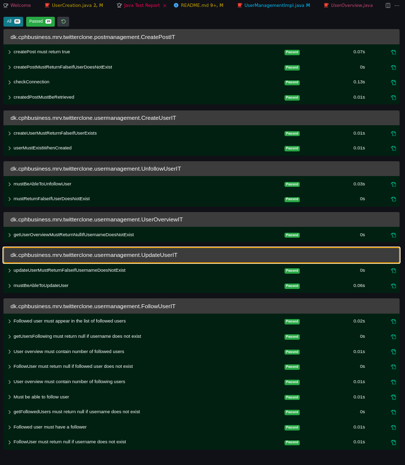
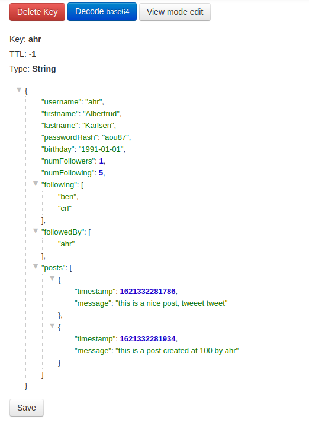

Run: 
> docker-compose -f docker-compose.db.yml up

Ports used are 22228 and 22229. You don't have to worry about collision.
I am using vscode. I would make the entire solution containerized, but I can't be bothered.

# Twitter-clone
## Task 1
See Assignment 5.

## Task 2
Implement the tiny twitter clone found at this repo, using only Redis as a data store.

You need to implement the two classes PostManagementImpl and UserManagementImpl, and to run the unit tests by right clicking the Java folder under Test, and choosing Run ‘All Tests’.
You are allowed to change the interface and DTOs, just write a small readme listing the changes.

#### Tests are passing

#### Redis structure

#### Task 2 response
You haven't created a User object to serialize from and deserialize to. I am using UserCreation for this atm. That's a non-solution. Create a User object or allow me to do so for you.

Why are you using boolean return statements in your UserManagement interface for your redis interactions? That's completely pointless if you ask me. I can't change it because it'll make the tests fail. Considering how all of this is supposed to be used in a backend - Consider using status codes: https://docs.oracle.com/javaee/7/api/javax/ws/rs/core/Response.Status.html

Outcommented an assertEquals and a test. It involves createPost taking two Strings - A username and a message. For some reason, someone expected a timestamp out of that message. See createPostIT.

You're using public fields in your dto objects. We were taught, that we can only do so, if it is absolutely necessary. I have not met such a scenario yet. This is not it either. I've changed all public fields to private with getters AND I've rewritten the tests accordingly. I will use what we've been taught, when what we've been taught is best practice.
https://stackoverflow.com/questions/1568091/why-use-getters-and-setters-accessors 

I don't see why you'd even use interfaces here. They're good at constricting classes to a specific setup. You can also use them for reflection. But here we're only binding them to one class each, and we're not using reflection. It's bloat. You're calling them contracts. Finding it strange to put business related aspects like that inside the code. Functionality-wise - It's bloat. We're not gaining anything. If you think it's for gaining an overview - That's what Javadocs is for:
https://www.tutorialspoint.com/java/java_documentation.htm 
That's my opinion. The code-base should be as clean as possible.

Deleted a lot of non-used imports.

I deleted the entire utils folder because it's completely pointless. All references to them can be reduced to 
> System.currentTimeMillis();

That's three files gone and less variables in constructors.

## Task 3
In a readme, write a short explanation of your redis data model. It should be clear enough for a developer to be able to implement the same thing.

#### Task 3 response
It's not my model. It's yours. You should've brought documentation to me about the structure of the data model. This is your architecture that I am implementing functionalies on. You've already defined the tests. Redis structure is at the top of the readme file.