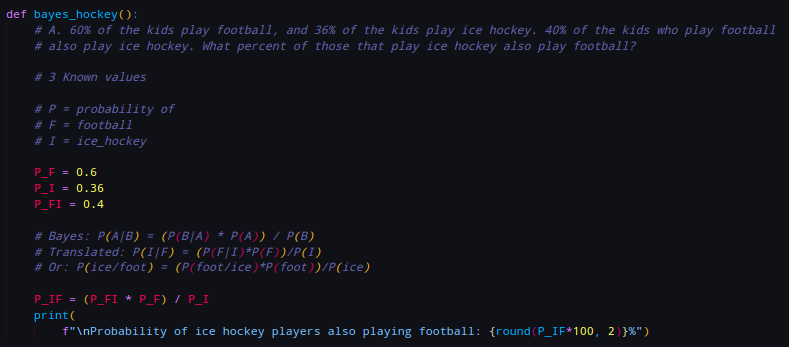
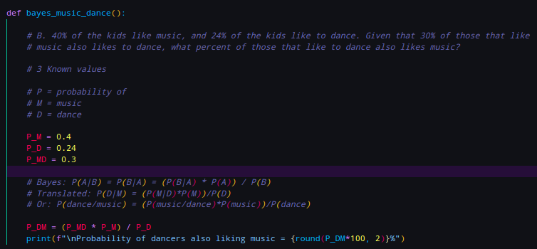
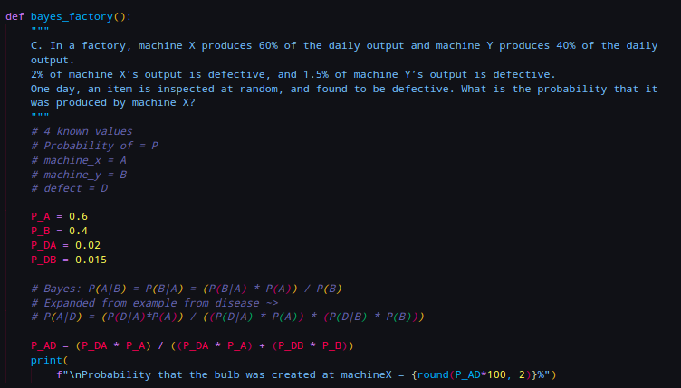
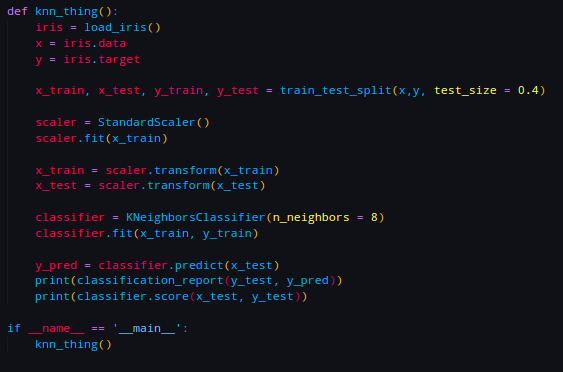
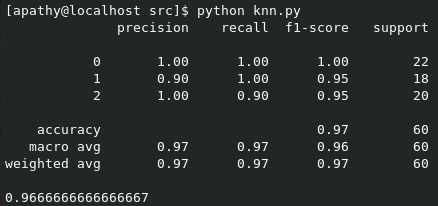
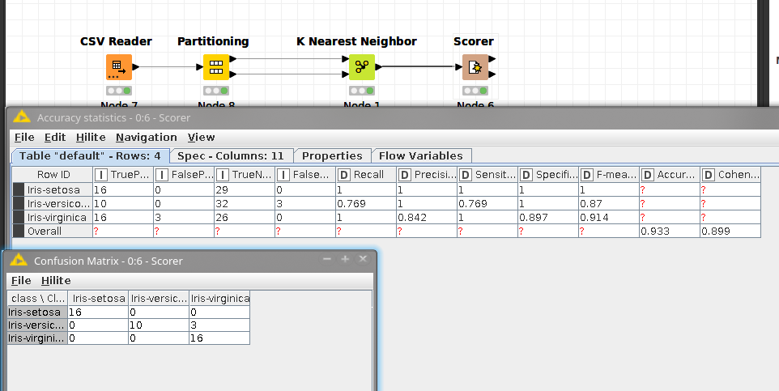
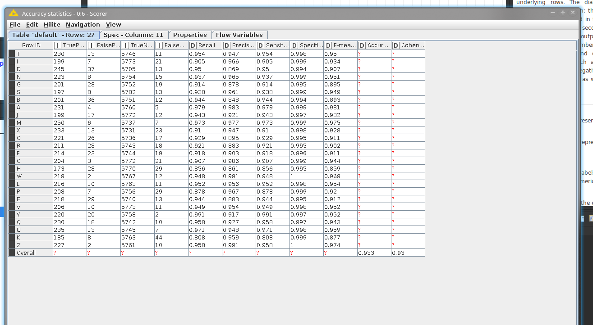
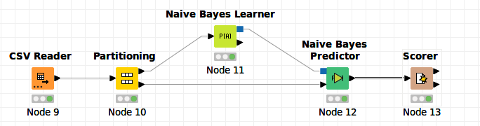
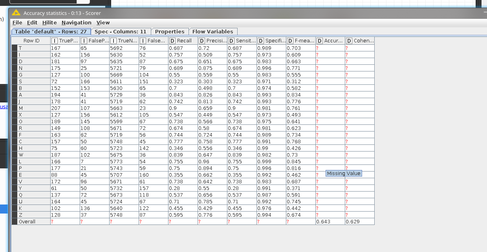
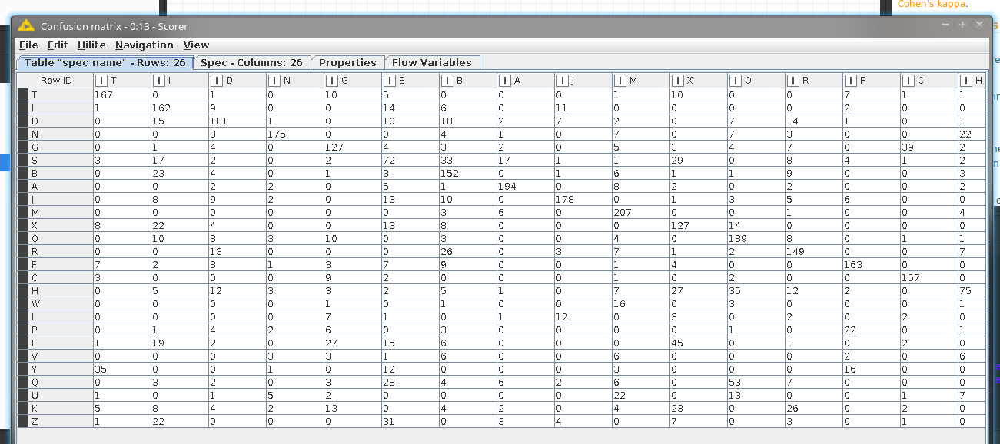

<h4>1. Bayes</h4>
<ul>
    <li>A.
         
        
        
    </li>
   <li>B.
         
        
        
   </li>
   <li>C.
         
        
        
   </li>
</ul>

<h4>2. </h4>

Make a KNN classifier on the IRIS dataset using Python. Make sure to split the dataset into training and
testing sets. 

 

<h4>3.</h4>

Download KNIME. Make a KNN clasifier on the IRIS dataset

<h4>4.</h4

Find a dataset that interests you on the UCI Machine Learning Repository. Make a KNN classifier on the
dataset, either in Python or in KNIME. Visualize the classified data.

<h4> 5 </h4>

Implement a Gaussian Naïve Bayes classifier on the same data set (in either Python or KNIME).

<h4> 6 </h4>

Decide which of the two classifiers you would use on new data. What is behind your decision?

This explains it better than I can.: 

https://www.datasciencecentral.com/profiles/blogs/comparing-classifiers-decision-trees-knn-naive-bayes

My subpar interpretation:

Consider bayes when:

Using big data when speed is a factor

High accuracy on big data is needed.

Less issues with dimensions and large feature sets.

Consider K-nn when:

Values which equals 0 breaks Bayes. They don't break k-nn

If the decision boundary isn't liniear, elliptical or parabolic, don't choose 
bayes.

Bayes requires underlying probability distributions. Knn does not.

Knn doesn't require training
